# 🛡️ Insurance Management System

This is a web-based Insurance Management System developed using Python and Django. The system is designed to manage customer insurance policies, handle claims, and facilitate interactions between customers and administrators.

## 📌 Project Description

The system allows administrators to manage insurance categories, policies, customers, and claims. Customers can register, log in, apply for policies, submit claims, and ask questions regarding their policies.

The project is divided into two main Django apps:
- `insurance` (Admin functionalities)
- `customer` (Customer functionalities)

## 🚀 Features

### Admin
- Admin account can be created using createsuperuser command.
- After login, admin can view/update/delete customer
- Can view/add/update/delete policy category like Life, Health, Motor, Travel
- Can view/add/update/delete policy
- Can view total policy holder, approved policy holder, disapproved policy holder
- Can approve policy, applied by customer
- Can answer customer question

### Customer
- Create account (no approval required by admin)
- After login, can view all policy that are added by admin.
- If customer likes any policy, then they can apply for it.
- When customer will apply for any policy, it will go into pending status, admin can approve it.
- Customer can check status of his policy under history section
- Customer can ask question from admin. 


### 👤 Admin Panel
- Login to admin dashboard
- Manage policy categories  
  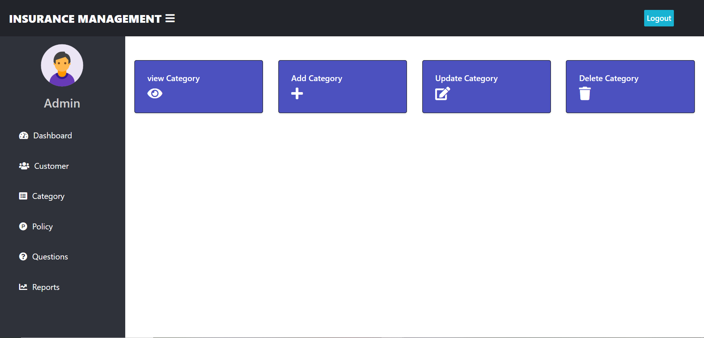
- Manage customers  
  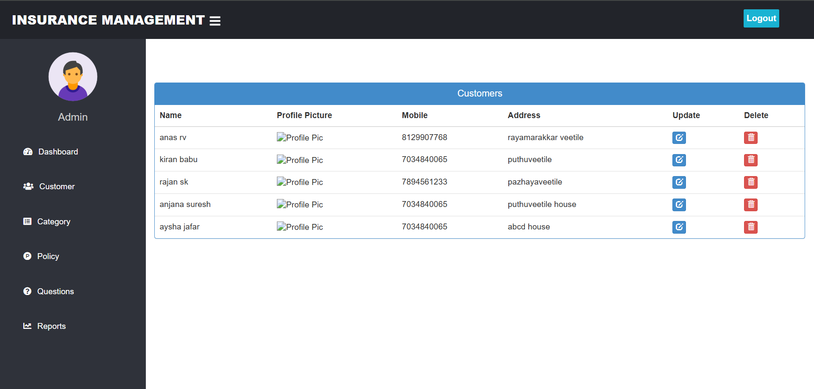
- Add/update/delete insurance policies  
  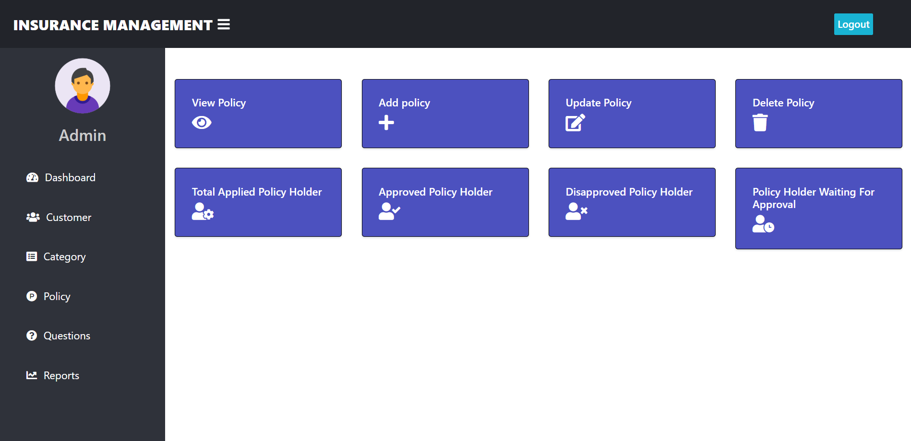
- View and answer customer questions  
  
- Approve or disapprove policy applications  
  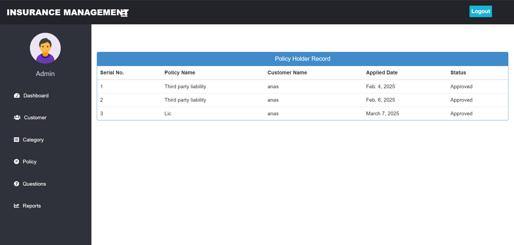  
  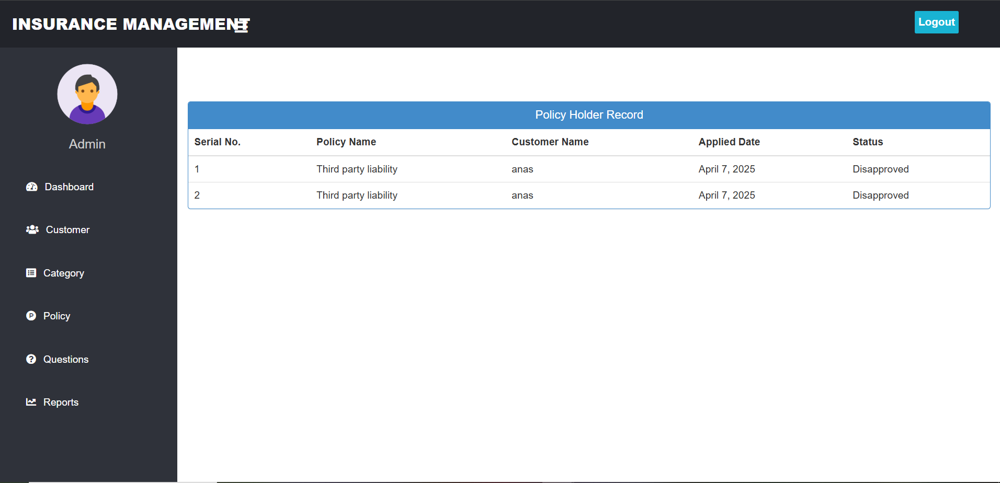
- View and manage submitted claims  
  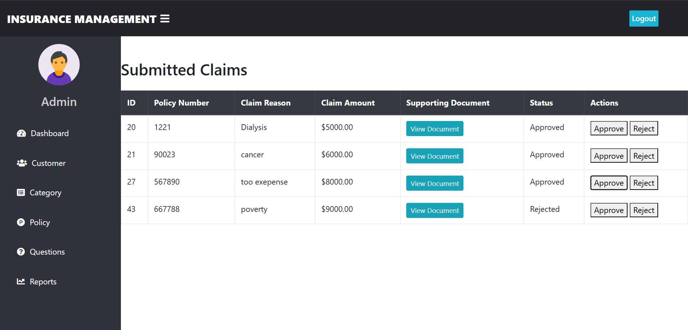
- Generate policy reports  
  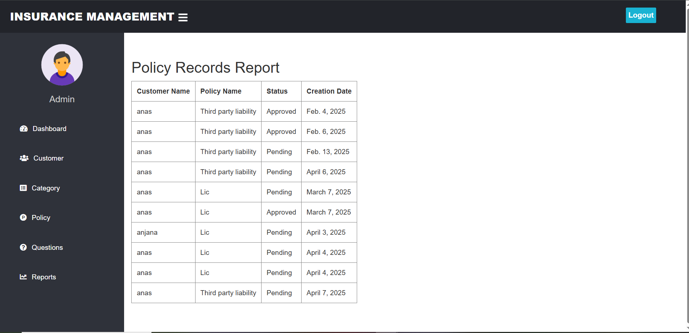

### 🧑‍💼 Customer Portal
- Sign up and log in  
  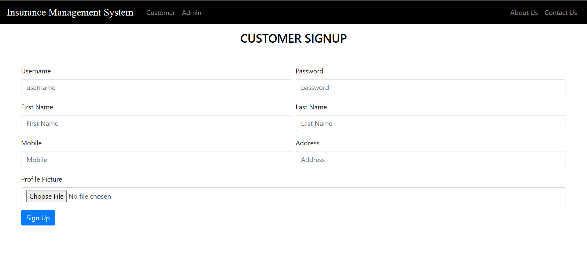  
  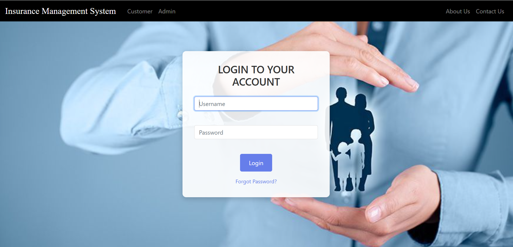
- Dashboard to view policy and account status  
  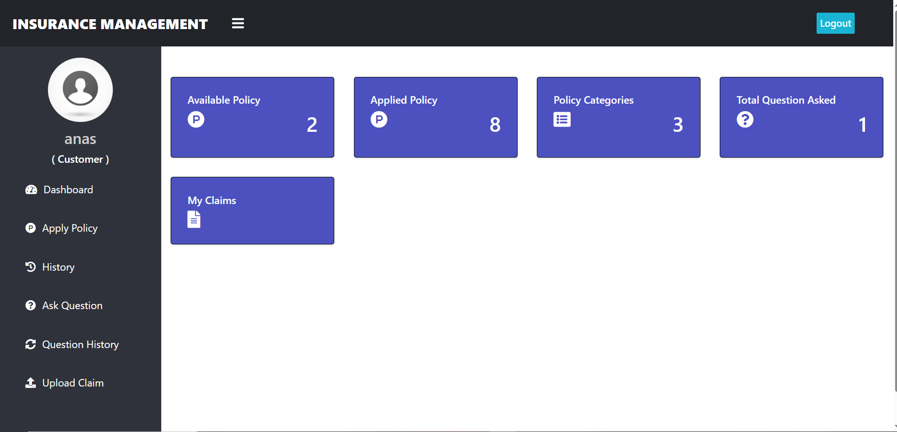
- Apply for insurance policies  
  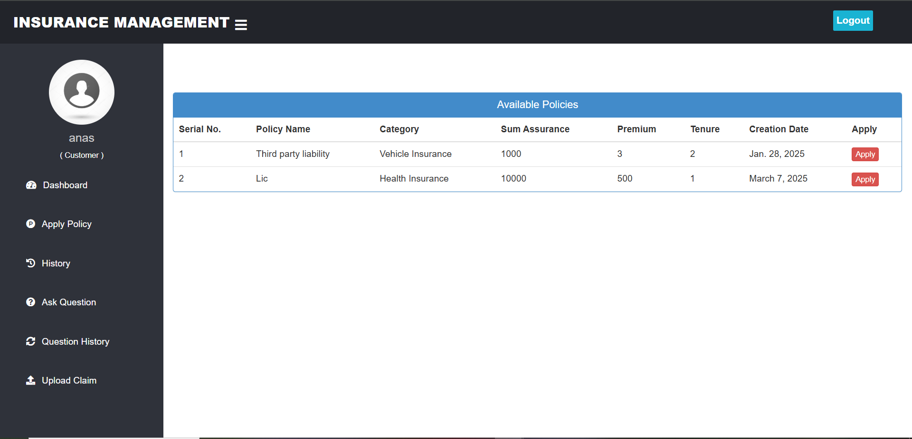
- View history of applied policies  
  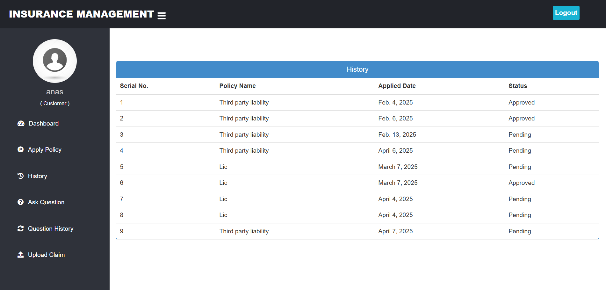
- Submit claims with reason, amount, and supporting documents  
  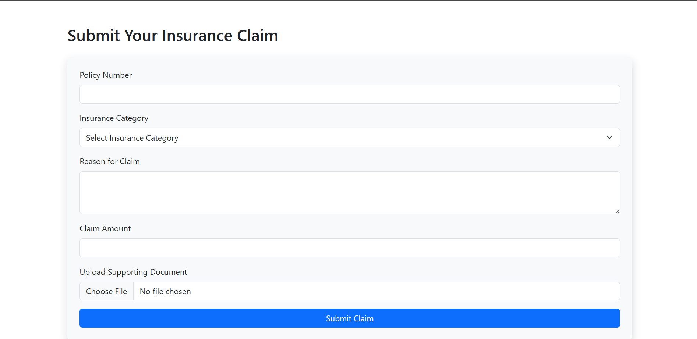
- Ask questions to the admin  
  
- View question history  
  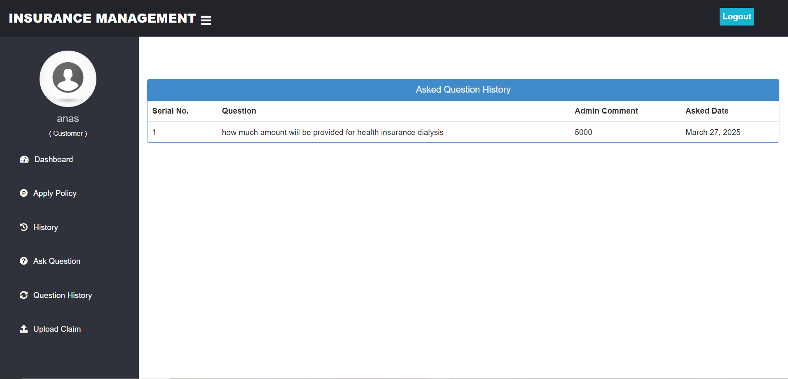
- Track policy status: waiting or approved  
  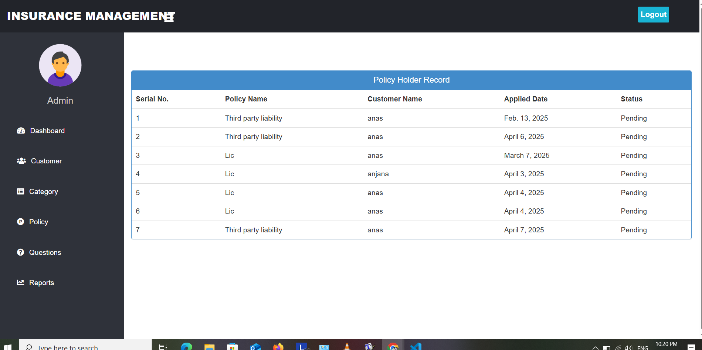
- View approved policy details  
  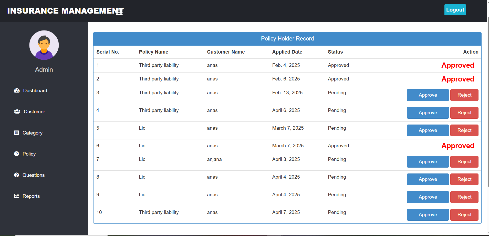
- Contact page for support  
  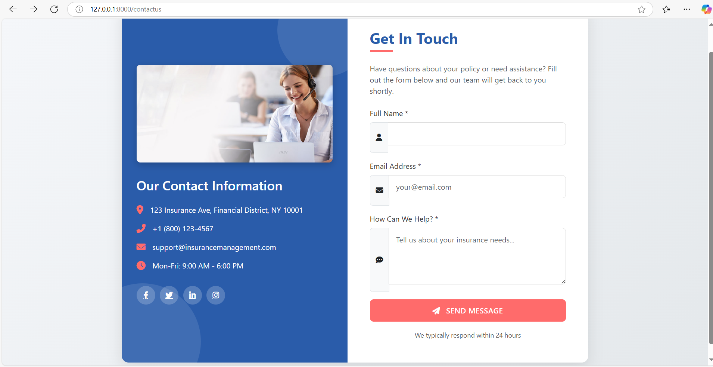

### 🌐 Public Pages
- Homepage  
  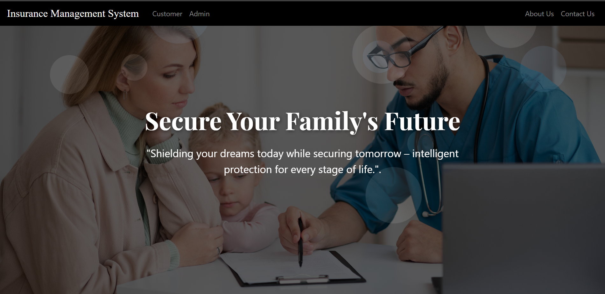
- Main landing page  
  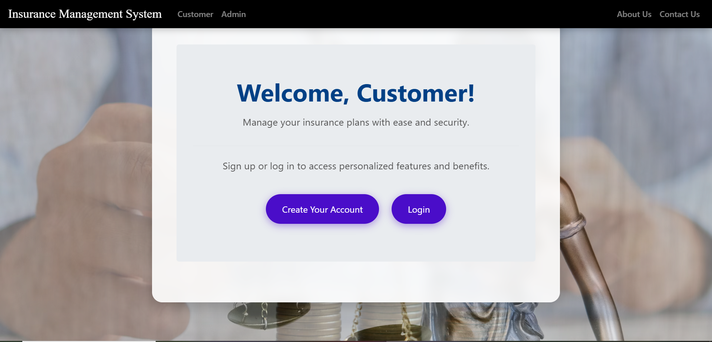


## ⚙️ Technologies Used

- Python
- Django Web Framework
- HTML/CSS/Bootstrap (for UI)
- SQLite (Default Django database)

## 🧭 How to Run

1. Clone this repository
2. Install dependencies  
   ```bash
   pip install -r requirements.txt
   py manage.py makemigrations
   py manage.py migrate
3. py manage.py runserver
